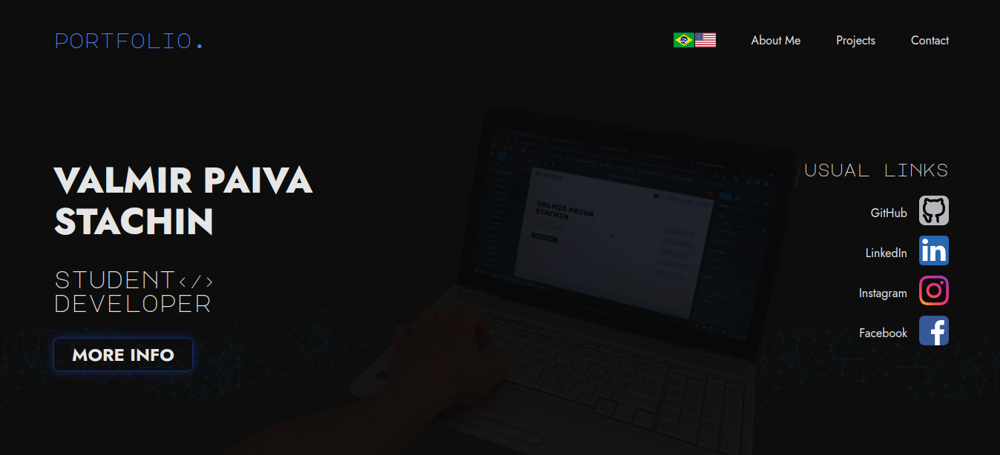

<h1 align="center">
  💻
  
  Portfolio Website
</h1>

Este é o repositório do meu website, desenvolvido utilizando React. Este site foi criado para mostrar minha experiência, projetos e habilidades como desenvolvedor web.

## Seções

O site possui 5 sessões:

- **Home (HeroPage):** Aqui temos uma breve apresentação e alguns links;
- **Sobre Mim:** Nessa seção há informações gerais sobre mim;
- **Projetos:** Possui alguns projetos que desenvolvi com links para os respectivos repositórios no GitHub;
- **InfoPage:** Mostra alguns conhecimentos que possuo e o meu currículo para ser acessado;
- **Contate-me:** Acesso a um formulário para me enviar uma mensagem.

## Tecnologias Utilizadas

- **React:** Utilizado como o framework principal para o desenvolvimento do frontend do site
- **Webpack e Babel:** Utilizado para transpilar o código JavaScript ES6+ para uma versão compatível com todos os navegadores.
- **JSX Structure:** Extensão para JavaScript que permite escrever marcação semelhante a HTML dentro de um arquivo JS.

## Como Rodar Localmente

- Clone este repositório para o seu computador.
- Certifique-se de ter o Node.js e o npm instalados.
- Na pasta raiz do projeto, execute o comando "npm install" (ou apenas "npm i")para instalar as dependências necessárias.
- Após a instalação, execute o comando "npm start" para iniciar o servidor de desenvolvimento.
- Abra o navegador e acesse http://localhost:3000 para visualizar o site.

## Observações

Este projeto ainda está em desenvolvimento e irá ser modificado. Algumas partes estão sendo melhoradas e novas funcionalidades podem e serão adicionadas no futuro. Sinta-se à vontade para acompanhar o progresso e contribuir com sugestões ou feedback.

Obrigado pela visita no repositório!

### Designer e Desenvolvedor

Valmir Paiva Stachin - valmirpaivacpm@gmail.com
